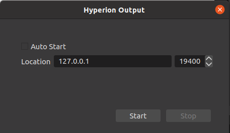

# hyperion-obs

[](https://github.com/hyperion-project/hyperion-obs-plugin/releases)
[](https://github.com/hyperion-project/hyperion-obs-plugin/actions)

An [OBS Studio][obs] plugin that provides output capabilities to a [Hyperion.ng][hyperion] Server. \
The idea for this plugin originated from a [Hyperion.ng][hyperion] fork of [Murat Seker][m-seker].

## Usage with hyperion-obs

- Open OBS and select the menu entry `Tools > Hyperion Streaming`.
- Enter the flatbuffer destination IP and select the appropriate port.
- Optionally you can change the `Priority` or the image `Output Decimation` factor.
- Click the `Start` button.



## Contributing

Contributions are welcome! Feel free to join us! We are looking always for people who wants to participate.<br>
[](https://github.com/hyperion-project/hyperion-obs-plugin/graphs/contributors)

For an example, you can participate in the translation.<br>
[](https://poeditor.com/join/project?hash=0diZuCpLVX)

## Download

See [Release Page](https://github.com/hyperion-project/hyperion-obs-plugin/releases)

## Build
### Windows & macOS (64-bit)
First follow the build instructions for OBS-Studio on [Windows][obs_build_windows]/[macOS][obs_build_macos].
- Add the following entries before the first configuration:

| Entry name         | Type     | Value (e.g.)            |
|--------------------|----------|-------------------------|
| OBS_SOURCE         | PATH     | /obs-studio             |
| OBS_BUILD          | PATH     | /obs-studio/build       |

- This should cause the plugin DLL file to be created in the desired development environment.

### Linux (64-bit)
- Install Git, CMake, QT5 and libobs

```
sudo apt install git cmake qtbase5-dev libobs-dev
```

- Get OBS Studio source code

```
git clone --recursive https://github.com/obsproject/obs-studio.git
```

- Build plugin

```
git clone --recursive https://github.com/hyperion-project/hyperion-obs-plugin.git
cd hyperion-obs-plugin
mkdir build && cd build
cmake -DOBS_SOURCE=../../obs-studio ..
make -j $(nproc)
sudo make install
```

[obs]: https://obsproject.com/
[obs_build_windows]: https://github.com/obsproject/obs-studio/wiki/install-instructions#windows-build-directions
[obs_build_macos]: https://github.com/obsproject/obs-studio/wiki/install-instructions#macos
[hyperion]: https://github.com/hyperion-project/hyperion.ng
[m-seker]: https://github.com/m-seker
